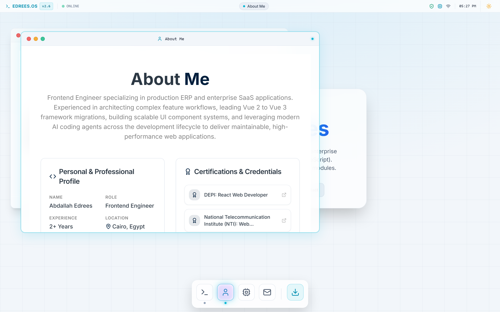
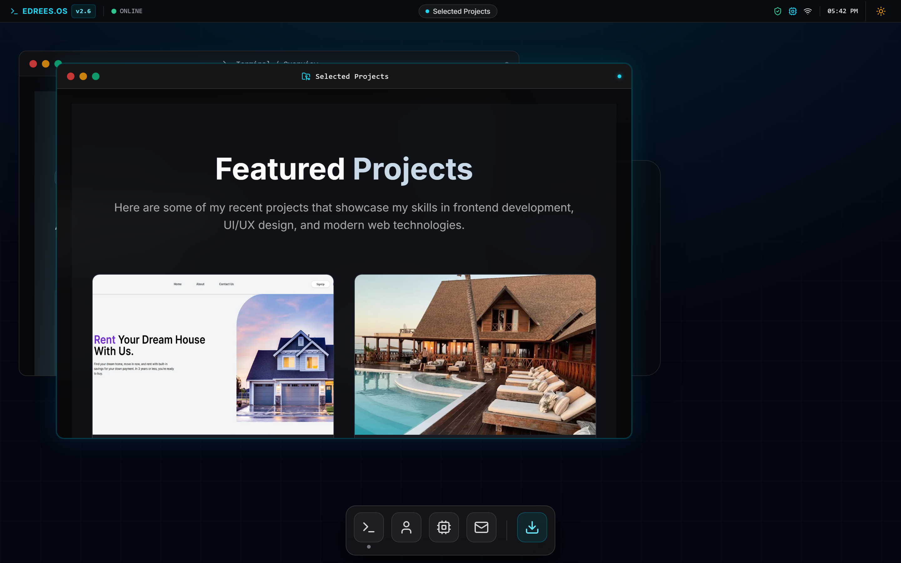
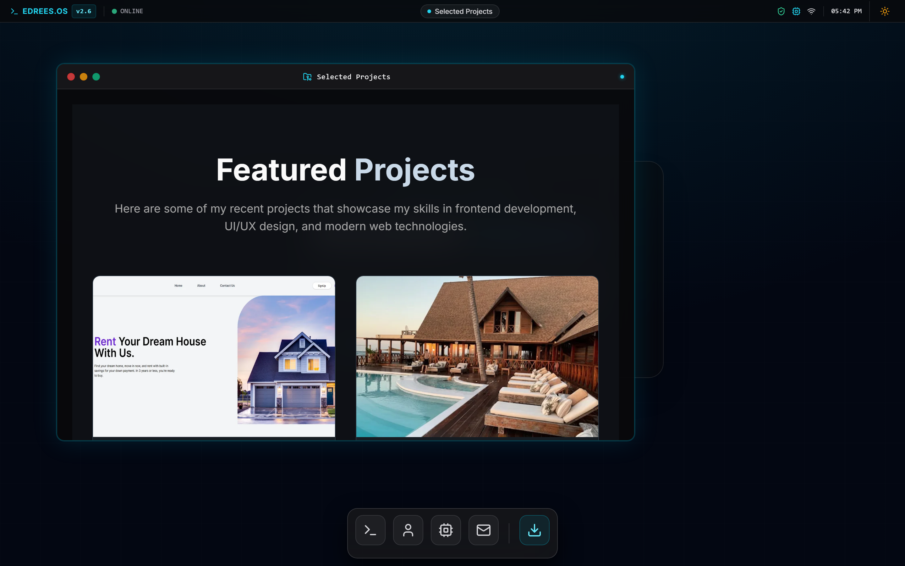
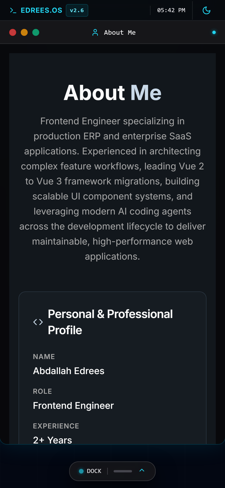
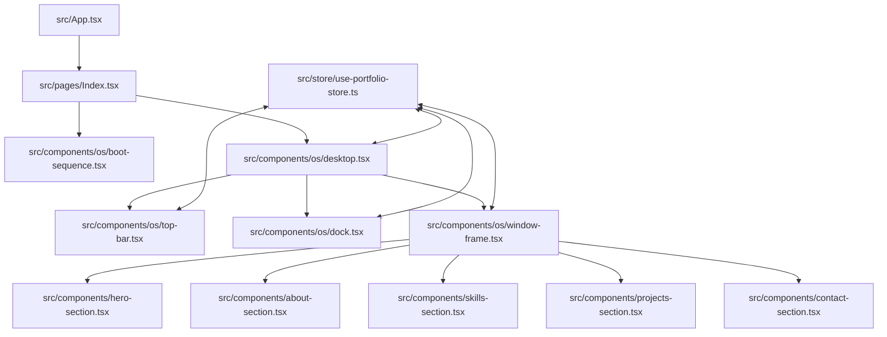

# Abdallah Edrees — Web OS Portfolio

[](https://react.dev/)
[](https://www.typescriptlang.org/)
[](https://vitejs.dev/)
[](https://tailwindcss.com/)
[](https://www.framer.com/motion/)
[](https://abdallahedreeso.vercel.app/)

An interactive, high-performance **Web OS Desktop Environment** portfolio presenting my frontend engineering experience, core technical competencies, featured project portfolio, and professional background as a Frontend Developer specializing in enterprise ERP & SaaS applications.

---

## 🌐 Live Demo

The portfolio is deployed and live at: **[abdallahedreeso.vercel.app](https://abdallahedreeso.vercel.app/)**

---

## 📷 Interface Showcase

### 🖥️ Desktop Workspace (Light Mode)
Multi-window desktop environment equipped with reactive window stacking, glassmorphic dock launcher, and developer bio card.


### 🌙 Cyberpunk Environment (Dark Theme)
FOUC-free dark mode highlighting glowing neon accents, active window focus management, and system status controls.


### 💼 Selected Projects Showcase
Featured project window presenting enterprise ERP platforms, tech badges, live deployment links, and WebP media cards.


### 📱 Responsive Mobile Adaptation
Touch-optimized Web OS layout featuring auto-maximized windows, fluid responsive scaling, and collapsible mobile dock.



---

## ✨ Features

### 🖥️ Web OS Desktop Experience
- **Interactive Desktop Workspace**: Multi-window desktop environment equipped with a custom bio card, top system bar, theme switcher, and glassmorphic dock launcher.
- **Window Management System**: Complete OS window controls supporting open, close, minimize, maximize/restore, position drag-and-drop, and active focus state tracking.
- **Z-Index Stacking & Stacking Engine**: Custom z-index manager with relative elevation ordering and baseline normalization (prevents unbounded integer growth when switching active windows).
- **Futuristic Boot Sequence**: Animated system kernel initialization log before displaying the main desktop environment.
- **FOUC-Free Theme Engine**: Dark/Light mode toggle powered by `next-themes` with an inline hydration script in `index.html` to eliminate theme flashes on load.
- **Responsive Mobile Adaptation**: Windows automatically adjust and auto-maximize on mobile viewports for optimal readability and touch navigation.

### 💼 Portfolio Modules & Content
- **Terminal / Overview (`hero`)**: Command-line developer intro featuring role overview, stack highlights, custom Chibi Edreeso avatar (`chibi-edreeso.webp`), and instant resume download (`Abdallah_Edrees_Frontend_CV.pdf`).
- **About Me (`about`)**: In-depth timeline covering 2+ years of professional engineering experience (Numo Training, SolutionPlus, Algoriza), credentials, education, and AI-assisted development workflows.
- **Technical Skills (`skills`)**: Categorized technical stack including Vue.js, Nuxt.js, React.js, TypeScript, Inertia.js, unit testing frameworks (Vitest, Vue Test Utils), and AI developer tooling (Claude Code, Antigravity, Gemini, Cursor).
- **Selected Projects (`projects`)**: Portfolio showcase featuring TradeX Platform, Real Estate Portal, Dream Place, and Headphone Store with tech badges, GitHub links, live demos, and webp visual previews.
- **Get In Touch (`contact`)**: Interactive contact window powered by EmailJS client integration, Zod schema validation, phone launcher, and one-click clipboard copy functionality.

---

## 🛠️ Tech Stack

### Core Framework & Tooling
- **React 18.3**: UI framework for building declarative component hierarchies.
- **TypeScript 5.5**: Strict type safety across window state management, store contracts, and component props.
- **Vite 5.4**: Fast build system with Hot Module Replacement (HMR) and production bundling.
- **Sharp 0.35**: Image and icon processing for multi-resolution favicons and optimized WebP visual assets.

### UI & Animation Architecture
- **Tailwind CSS 3.4**: Utility-first CSS framework with extended design tokens and cyber-minimalist dark mode accents.
- **Shadcn UI & Radix UI**: Accessible, unstyled component primitives for dialogs, cards, popovers, and tooltips.
- **Framer Motion 12.23**: Declarative spring animations, gesture drag controls, and dock icon magnification.
- **Lucide React**: Vector icon set for OS controls, system status indicators, and window headers.
- **Typography**: Google Fonts integration using `Inter` for clean body UI and `Fira Code` for terminal aesthetics.

### State, Data & Services
- **React `useSyncExternalStore`**: Zero-dependency reactive state store (`use-portfolio-store.ts`) for window management with referentially stable snapshots.
- **TanStack React Query 5.56**: Async state and data fetching primitives.
- **Supabase JS 2.51**: Backend-as-a-Service integration for cloud storage and data persistence.
- **React Hook Form & Zod**: Form state handling and schema validation for contact forms.
- **EmailJS**: Client-side email dispatch service for incoming inquiries.

---

## 📋 Architecture Overview


```mermaid
flowchart TD
    App[src/App.tsx] --> Index[src/pages/Index.tsx]
    Index --> Boot[src/components/os/boot-sequence.tsx]
    Index --> Desktop[src/components/os/desktop.tsx]
    
    Desktop --> TopBar[src/components/os/top-bar.tsx]
    Desktop --> Dock[src/components/os/dock.tsx]
    Desktop --> WindowFrame[src/components/os/window-frame.tsx]
    
    WindowFrame --> Hero[src/components/hero-section.tsx]
    WindowFrame --> About[src/components/about-section.tsx]
    WindowFrame --> Skills[src/components/skills-section.tsx]
    WindowFrame --> Projects[src/components/projects-section.tsx]
    WindowFrame --> Contact[src/components/contact-section.tsx]

    Store[src/store/use-portfolio-store.ts] <--> Desktop
    Store <--> WindowFrame
    Store <--> Dock
    Store <--> TopBar
```

---

## 📁 Project Structure

```text
abdallahedreeso/
├── docs/
│   └── screenshots/                  # Curated Web OS showcase screenshots
│       ├── desktop-overview.png      # Desktop environment (Light mode)
│       ├── dark-mode.png             # Cyberpunk environment (Dark theme)
│       ├── projects-showcase.png     # Featured projects module
│       └── mobile-view.png           # Mobile responsive layout
├── public/                           # Static assets
│   ├── Abdallah_Edrees_Frontend_CV.pdf # Resume PDF
│   ├── favicon.ico                   # Custom icon
│   ├── og-image.png                  # OpenGraph preview card (1200x630)
│   └── robots.txt
├── src/
│   ├── assets/                       # Visual assets & project graphics
│   │   ├── chibi-edreeso.webp        # Custom Chibi developer avatar
│   │   ├── chibi-edreeso-favicon.ico # Favicon source icon
│   │   └── projects/                 # Project preview graphics
│   │       ├── dream-place.webp
│   │       ├── headphone-store.webp
│   │       ├── real-state.webp
│   │       └── tradex-platform.webp
│   ├── components/
│   │   ├── os/                       # Web OS Desktop Architecture
│   │   │   ├── boot-sequence.tsx     # Animated boot sequence
│   │   │   ├── desktop.tsx           # Desktop workspace & window manager
│   │   │   ├── dock.tsx              # Glassmorphic application dock
│   │   │   ├── top-bar.tsx           # System status bar & theme controls
│   │   │   └── window-frame.tsx      # Window controls, drag, resize frame
│   │   ├── ui/                       # Shadcn UI reusable primitives
│   │   ├── about-section.tsx         # Experience, credentials & timeline
│   │   ├── contact-section.tsx       # Contact form & EmailJS integration
│   │   ├── hero-section.tsx          # Terminal overview & bio card
│   │   ├── projects-section.tsx      # Project showcase & tech badges
│   │   └── skills-section.tsx        # Categorized technical competencies
│   ├── hooks/                        # Custom React hooks (use-mobile, use-toast)
│   ├── pages/                        # App routes (Index.tsx, NotFound.tsx)
│   ├── store/                        # Custom reactive window store (use-portfolio-store.ts)
│   ├── App.tsx                       # App router & QueryClient setup
│   ├── index.css                     # Design tokens & global CSS
│   └── main.tsx                      # Application root entry
├── index.html                        # HTML5 template with SEO & FOUC script
├── package.json                      # Dependency declarations & scripts
├── tailwind.config.ts                # Tailwind design token configuration
├── tsconfig.json                     # TypeScript compiler configuration
└── vite.config.ts                    # Vite build configuration
```

---

## ⚡ Performance & Engineering Details

- **Code Splitting & Lazy Window Loading**: All window section modules (`HeroSection`, `AboutSection`, `SkillsSection`, `ProjectsSection`, `ContactSection`) are dynamically imported using `React.lazy()` and wrapped in `Suspense` fallbacks to minimize initial bundle size and speed up first contentful paint.
- **Micro State Engine (`useSyncExternalStore`)**: State operations for opening, closing, minimizing, focusing, and ordering windows utilize React's native `useSyncExternalStore` hook with referentially memoized snapshot selectors (`getOpenWindowIdsSnapshot`), ensuring zero unnecessary component re-renders.
- **Z-Index Stacking Protection**: Window z-index calculation maintains explicit relative depth while automatically normalizing stack levels once the max threshold reaches 100 to prevent layout memory inflation.
- **Hardware-Accelerated Window Physics**: Window movements leverage Framer Motion drag controls along with explicit CSS `will-change: transform, opacity` hints for smooth 60fps window interactions.
- **SEO & Social Sharing Metadata**: Fully configured OpenGraph meta tags, Twitter summary card metadata, JSON-LD Schema.org Person structured data, and canonical URL tags for optimum search engine visibility.

---

## 🚀 Getting Started

### Prerequisites
- Node.js 18.x or higher
- npm or bun

### Installation

1. Clone the repository:
   ```bash
   git clone https://github.com/abdallahedreeso/abdallahedreeso.git
   cd abdallahedreeso
   ```

2. Install dependencies:
   ```bash
   npm install
   ```

3. Start the local development server:
   ```bash
   npm run dev
   ```

4. Build for production:
   ```bash
   npm run build
   ```

5. Preview the production build locally:
   ```bash
   npm run preview
   ```

### NPM Scripts

| Command | Description |
| :--- | :--- |
| `npm run dev` | Starts Vite local development server |
| `npm run build` | Compiles production assets |
| `npm run build:dev` | Compiles development mode build |
| `npm run preview` | Serves production build locally |
| `npm run lint` | Runs ESLint code quality check |

---

## 📬 Contact & Social Links

- **Author**: Abdallah Edrees
- **Email**: [abdallahedreeso2@gmail.com](mailto:abdallahedreeso2@gmail.com)
- **GitHub**: [github.com/abdallahedreeso](https://github.com/abdallahedreeso)
- **LinkedIn**: [linkedin.com/in/abdallahedreeso](https://linkedin.com/in/abdallahedreeso/)
