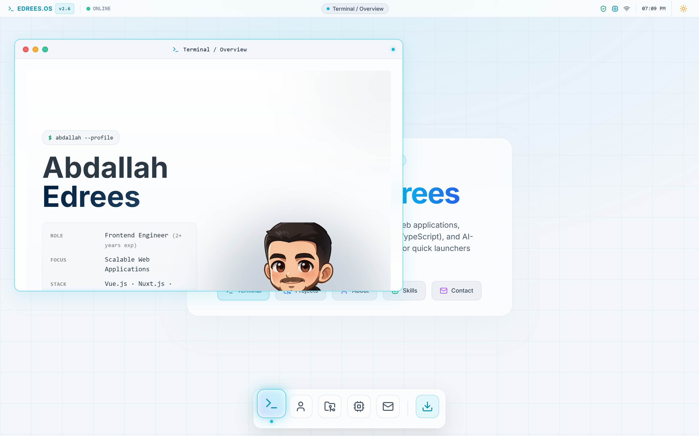
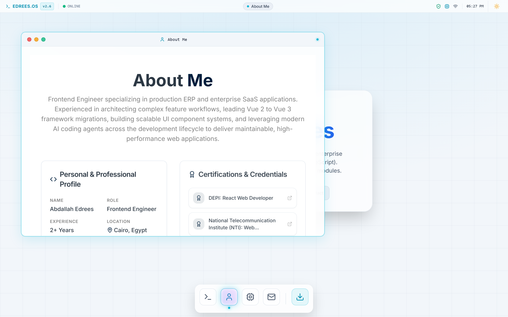
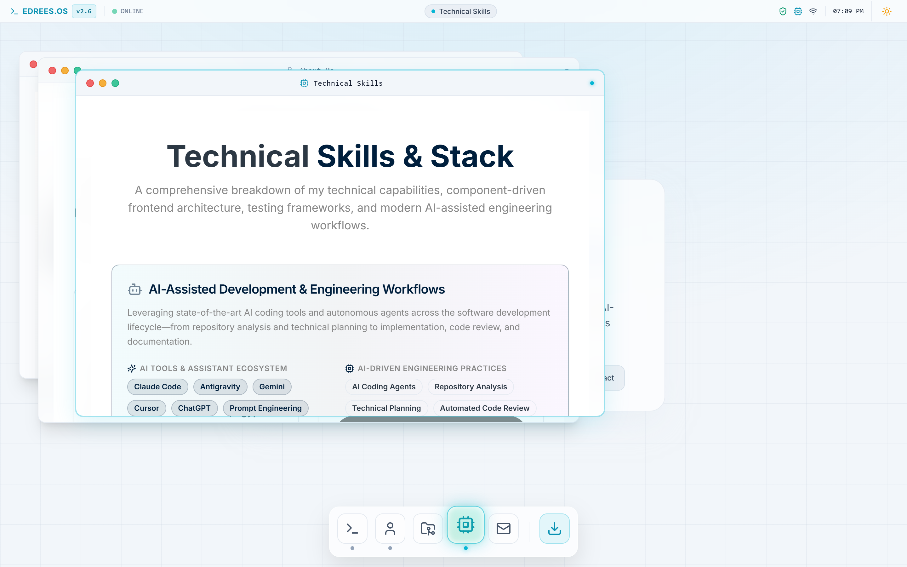
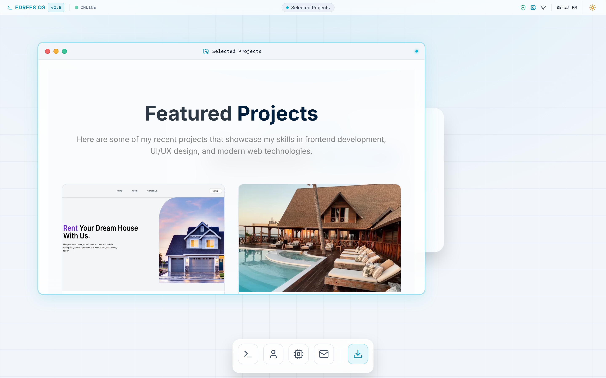
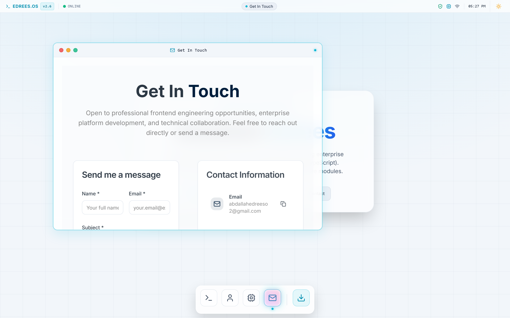
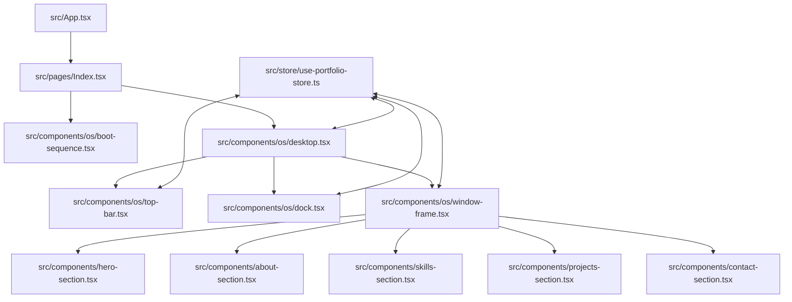

# Abdallah Edrees — Web OS Portfolio

[](https://react.dev/)
[](https://www.typescriptlang.org/)
[](https://vitejs.dev/)
[](https://tailwindcss.com/)
[](https://www.framer.com/motion/)

An interactive, high-performance **Web OS Desktop Environment** portfolio website presenting my frontend engineering experience, core competencies, project portfolio, and professional background as a Frontend Developer.

---

## 🌐 Live Demo

The portfolio is deployed and live at: **[abdallahedreeso.vercel.app](https://abdallahedreeso.vercel.app/)**

---

## 📷 Screenshots

### Desktop Environment Overview


### Hero / Terminal Window


### About Window


### Technical Skills Window


### Selected Projects Window


### Contact Window


---

## ✨ Features

### Web OS Desktop Experience
- **Interactive Desktop Workspace**: Multi-window environment complete with desktop ambient bio card, quick launchers, top status bar, and glassmorphic dock.
- **Window Management**: Windows can be opened, closed, minimized, maximized, focused, and dragged across the workspace.
- **Z-Index Stacking & Focus Engine**: Dynamic window z-index management with relative order preservation and baseline normalization to ensure active windows always stay focused on top.
- **Responsive Mobile Adaptation**: Windows auto-maximize on mobile viewports for optimal readability and touch navigation.
- **Futuristic Boot Sequence**: Animated system boot-up sequence with kernel log initialization before launching the desktop workspace.

### Portfolio Modules & Content
- **Terminal / Overview (`hero`)**: Command-line style developer overview detailing role, stack, experience, and direct resume download.
- **About Me (`about`)**: Detailed breakdown of 2+ years professional experience (Numo Training, SolutionPlus, Algoriza), credentials, education, and AI-assisted workflows.
- **Technical Skills (`skills`)**: Categorized technical competencies spanning Vue.js, Nuxt.js, React.js, TypeScript, testing frameworks (Vitest, Vue Test Utils), and AI developer tools (Claude Code, Antigravity, Gemini, Cursor).
- **Selected Projects (`projects`)**: Showcase of featured and secondary applications with tech stack badges, live demo links, and GitHub repositories.
- **Get In Touch (`contact`)**: Interactive contact window with direct EmailJS client integration, Zod schema validation, phone launcher, and one-click email clipboard copy.

### Design System & UX
- **Dual Theme Engine**: Dark and light mode toggle with glassmorphic frosted elements and smooth state transitions.
- **Cyber-Minimalist Aesthetics**: Tailored gradient accents, ambient grid overlays, and subtle glowing borders.
- **Physics-Based Motion**: Framer Motion spring physics for window dragging, minimize/maximize transitions, and dock icon hover scaling.

---

## 🛠️ Tech Stack

### Core Framework & Tooling
- **React 18.3**: UI library for building component-driven interfaces.
- **TypeScript 5.5**: Type safety across windows, store, and component interfaces.
- **Vite 5.4**: Next-generation frontend build tool and hot module replacement.

### UI & Styling
- **Tailwind CSS 3.4**: Utility-first styling framework with custom design tokens.
- **Shadcn UI & Radix UI**: Accessible UI component primitives.
- **Framer Motion 12.23**: Declarative spring animations and gesture-based window drag controls.
- **Lucide React**: Vector icons for OS controls, window headers, and dock items.

### State & Form Management
- **React `useSyncExternalStore`**: Zero-overhead, custom reactive state store (`use-portfolio-store.ts`) for window management with referentially-stable snapshots.
- **React Hook Form**: Form state management with performance optimization.
- **Zod**: TypeScript-first schema validation.
- **EmailJS**: Client-side email dispatch for contact inquiries.

---

## 📋 Architecture Overview


```mermaid
flowchart TD
    App[src/App.tsx] --> Index[src/pages/Index.tsx]
    Index --> Boot[src/components/os/boot-sequence.tsx]
    Index --> Desktop[src/components/os/desktop.tsx]
    
    Desktop --> TopBar[src/components/os/top-bar.tsx]
    Desktop --> Dock[src/components/os/dock.tsx]
    Desktop --> WindowFrame[src/components/os/window-frame.tsx]
    
    WindowFrame --> Hero[src/components/hero-section.tsx]
    WindowFrame --> About[src/components/about-section.tsx]
    WindowFrame --> Skills[src/components/skills-section.tsx]
    WindowFrame --> Projects[src/components/projects-section.tsx]
    WindowFrame --> Contact[src/components/contact-section.tsx]

    Store[src/store/use-portfolio-store.ts] <--> Desktop
    Store <--> WindowFrame
    Store <--> Dock
    Store <--> TopBar
```

---

## 📁 Project Structure

```text
abdallahedreeso/
├── docs/
│   └── screenshots/              # Real high-res Web OS screenshots
│       ├── desktop-overview.png
│       ├── hero-terminal.png
│       ├── about-window.png
│       ├── skills-window.png
│       ├── projects-window.png
│       └── contact-window.png
├── public/                       # Static public assets (resume.pdf, favicon)
├── src/
│   ├── assets/                   # WebP images & project assets
│   ├── components/
│   │   ├── os/                   # Web OS Architecture Components
│   │   │   ├── boot-sequence.tsx # Animated OS boot sequence
│   │   │   ├── desktop.tsx       # Desktop canvas & lazy window loader
│   │   │   ├── dock.tsx          # Glassmorphic dock & quick resume button
│   │   │   ├── top-bar.tsx       # System status bar & theme toggle
│   │   │   └── window-frame.tsx  # Drag, resize, traffic lights window frame
│   │   ├── ui/                   # Reusable Shadcn UI primitives
│   │   ├── about-section.tsx     # About Me module
│   │   ├── contact-section.tsx   # Contact form module
│   │   ├── hero-section.tsx      # Terminal / Overview module
│   │   ├── projects-section.tsx  # Selected Projects module
│   │   └── skills-section.tsx    # Technical Skills module
│   ├── hooks/                    # Custom hooks (mobile detection, toast)
│   ├── pages/                    # Router entry page (Index.tsx)
│   ├── store/                    # Lightweight custom store (use-portfolio-store.ts)
│   ├── App.tsx                   # App router & QueryClient setup
│   ├── index.css                 # Global CSS & Tailwind design tokens
│   └── main.tsx                  # React DOM root entry point
├── package.json
├── tailwind.config.ts
├── tsconfig.json
└── vite.config.ts
```

---

## ⚡ Performance & Engineering Details

- **Code Splitting & Lazy Window Loading**: All window section components (`HeroSection`, `AboutSection`, `SkillsSection`, `ProjectsSection`, `ContactSection`) are dynamically imported via `React.lazy` and `Suspense` fallbacks to minimize initial bundle payload.
- **Custom Reactive Store (`useSyncExternalStore`)**: Window state management uses React's native `useSyncExternalStore` API with memoized snapshots (`getOpenWindowIdsSnapshot`), avoiding third-party store bundle overhead and preventing unnecessary re-renders.
- **Z-Index Boundary Protection**: Normalizes stacking order once highest z-index reaches threshold 100 while strictly maintaining relative window depth.
- **Hardware Acceleration**: Drag operations utilize Framer Motion's `useDragControls` and hardware-accelerated CSS `willChange: transform, opacity` properties for 60fps window movement.
- **Asset Optimization**: High-resolution images utilize WebP formats and async decoding (`decoding="async"`, `loading="lazy"`).

---

## 🚀 Getting Started

### Prerequisites
- Node.js 18.x or higher
- npm or bun

### Installation

1. Clone the repository:
   ```bash
   git clone https://github.com/abdallahedreeso/abdallahedreeso.git
   cd abdallahedreeso
   ```

2. Install dependencies:
   ```bash
   npm install
   ```

3. Start the development server:
   ```bash
   npm run dev
   ```

4. Build for production:
   ```bash
   npm run build
   ```

5. Preview production build locally:
   ```bash
   npm run preview
   ```

---

## 📬 Contact & Links

- **Author**: Abdallah Edrees
- **Email**: [abdallahedreeso2@gmail.com](mailto:abdallahedreeso2@gmail.com)
- **GitHub**: [github.com/abdallahedreeso](https://github.com/abdallahedreeso)
- **LinkedIn**: [linkedin.com/in/abdallahedreeso](https://linkedin.com/in/abdallahedreeso/)
