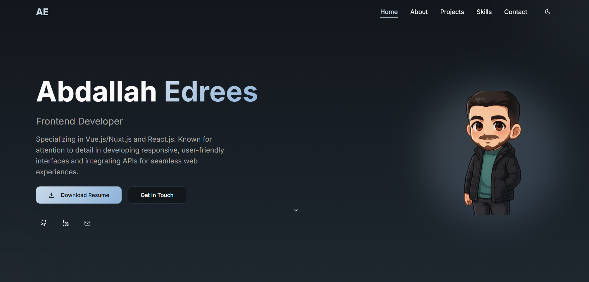

# Abdallah Edrees - Frontend Developer Portfolio

  

  
  
  
  
  

## 🚀 Overview

A modern, responsive portfolio website built with React, TypeScript, and Shadcn UI. This portfolio showcases my skills, projects, and professional experience as a Frontend Developer specializing in Vue.js/Nuxt.js and React.js.

## ✨ Features

- **Responsive Design**: Optimized for all device sizes
- **Dark/Light Mode**: Theme toggle with system preference detection
- **Animated UI**: Smooth animations and transitions using Framer Motion
- **Contact Form**: Integrated with EmailJS for easy communication
- **Project Showcase**: Highlighting featured and other projects
- **Skills & Experience**: Comprehensive display of technical skills and work history
- **Modern UI Components**: Built with Shadcn UI and Tailwind CSS

## 🛠️ Technologies Used

### Core
- **React**: Frontend library for building user interfaces
- **TypeScript**: Static typing for improved developer experience
- **Vite**: Next-generation frontend tooling
- **Tailwind CSS**: Utility-first CSS framework

### UI & Animation
- **Shadcn UI**: High-quality React components
- **Framer Motion**: Animation library for React
- **Lucide React**: Beautiful & consistent icons
- **Tailwind Merge**: Smart way to merge Tailwind CSS classes

### Form & Validation
- **React Hook Form**: Performant form management
- **Zod**: TypeScript-first schema validation
- **EmailJS**: Email sending directly from client-side

### State Management & Routing
- **TanStack Query**: Data fetching and state management
- **React Router DOM**: Routing for React applications

## 🚀 Getting Started

### Prerequisites

- Node.js (v16 or higher)
- npm or yarn

## 🌐 Deployment

This site is deployed and accessible at [abdallahedreeso.lovable.app](https://abdallahedreeso.lovable.app/).

## 📬 Contact

Abdallah Edrees - [abdallahedreeso2@gmail.com](mailto:abdallahedreeso2@gmail.com)

- GitHub: [github.com/abdallahedreeso](https://github.com/abdallahedreeso)
- LinkedIn: [linkedin.com/in/abdallahedreeso](https://linkedin.com/in/abdallahedreeso/)
